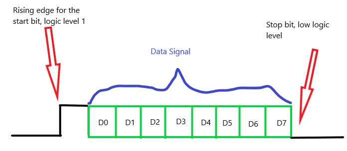
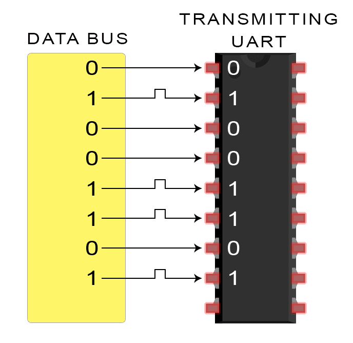
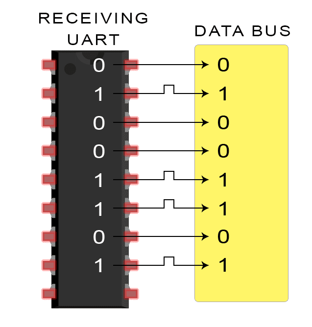

# UART - Universal asynchronous receiver / transmitter

### Team members

* Štěpán Večeřa (responsible for xxx)
* Romain Fresneau (responsible for xxx)
* Rishat Khaibullin (responsible for xxx)

### Table of contents

* [Project objectives](#objectives)
* [Hardware description](#hardware)
* [VHDL modules description and simulations](#modules)
* [TOP module description and simulations](#top)
* [Video](#video)
* [References](#references)

## Project objectives

The data for the UART that will transmit it comes from a data bus. Another device, such as a CPU, RAM, uses the data bus to deliver data to the UART. Data is sent in parallel from the data bus to the UART. After receiving parallel data from the data bus, the  UART creates the data packet by adding a start bit, a parity bit, and a stop bit. The data packet is then serially output at the Tx pin. The Rx pin on the receiving UART reads the data bit by bit. The data is subsequently converted back into parallel form by the receiving UART, which eliminates the start bit, parity bit, and stop bit. At the end, the second part of UART is transmitting the data in parallel way to the data bus on the receiving end.

In our case we decided a trame for transmission of data:
UART data is organized into packets. Each packet contains 1 start bit, 8 data bits. In this project an optional parity bit is not necessary, and at the end of the packet we have 1 stop bits.
To understand you can see what the packet of data can look like :

We need to use a clock in order to use signals, just as we did during laboratories, we use clock_enable process.
### This design includes 1 start bit, 8 data bits and 1 stop bits.We want to creat it with State Machine structure using VHDL.

## ADVANTAGES AND DISADVANTAGES OF UARTS
There is no perfect communication protocol, although UARTs are pretty good at what they do. Here are some advantages and disadvantages to help you decide whether they are appropriate for your project:

### ADVANTAGES
    • Only two wires are used.
    • Has a parity bit that can be used to check for errors, but in our solution, we do not use it.
    • The data packet's structure can be modified as long as both sides are prepared.
    • This approach is well-documented and commonly used.
### DISADVANTAGES
    • The data frame size is restricted to a maximum of 9 bits.
    • Multiple slave or master systems are not supported.
    • Each UART's baud rates must be within ten percent of one another.
    • Do not have full duplex mode
    
This UART is a programmable logic component with a simple asynchronous serial interface that allows for communication. The system clock, baud rate, data length, parity scheme, and oversampling rate can all be customized by the user.
    

## Hardware description

Write your text here.

## VHDL modules description and simulations

## Baud rate definition :
Firstly, it is necessary to know what is this value.
In the UART communication data transmission speed is measured by Baud Rate. Baud rate describes the total number of bit sent through serial communication. It includes Start bit, 
Data byte, Parity bit and Stop bit. Transmitter and receiver need to be maintained in the baud rate.

## Transmission delay :
The transmission rate is measured by bits per second. Each bit has a fixed time duration while transmission. The transmission delay for each bit 104.16 μs which is constant till the end of communication.

### Example
The baud rate is 9600.
The transmission delay can be calculated by Transmission delay =1/9600 =104.16 μs.
That is to say, our solution needs to achieves the baud rate by generating clock enable pulses at those frequencies. 
It is derived from the system clock clk wich we used many time in laboratories, it must be specified in the generic parameter clk_freq.

## Transmit Circuit :
The data on tx data is latched into an internal shift register when the tx ena input is asserted.
Along with the start and stop bits. The baud pulse then allows the system clock to move the register contents to the tx line at the baud rate on a regular basis.
When the transmission is complete and the circuit is ready to take new data to send, the TX Done output informs the user logic.

## Receive Circuit :
The receive circuit monitors the rx input on each pulse. If it detects a rising edge to logic high, it recognizes an incoming start bit. 
At this point, it begins shifting the value of the rx line into a shift register at the baud rate.

Once the entire data word is shifted into the register, the receive circuitry verifies the data. 
It then outputs the received data on the rx_data port . A high-to-low transition on the rx_busy port signifies to the user logic that new receive data is now available.

## TOP module description and simulations

Write your text here.

## Video

Write your text here

## References

1. Write your text here.
